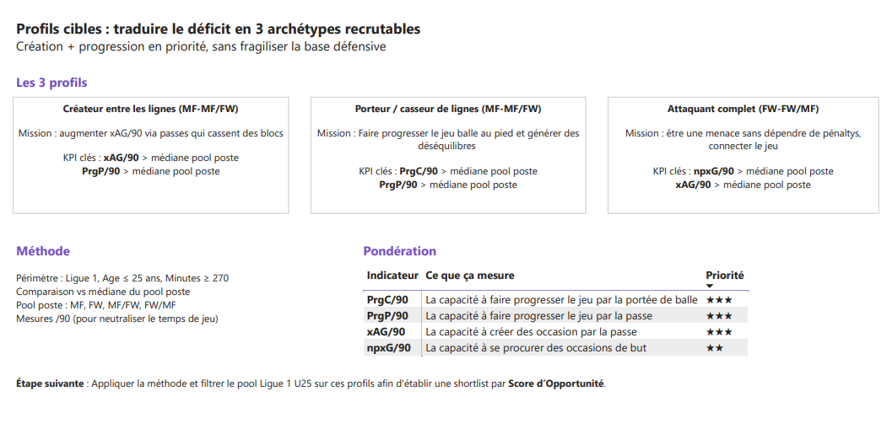
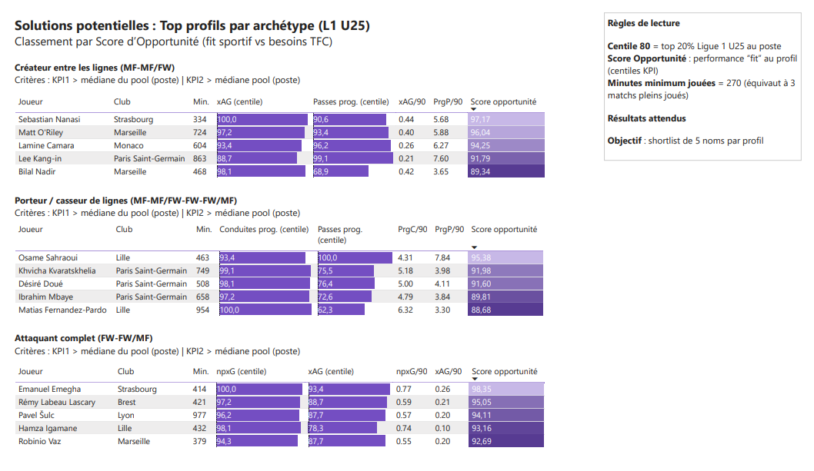
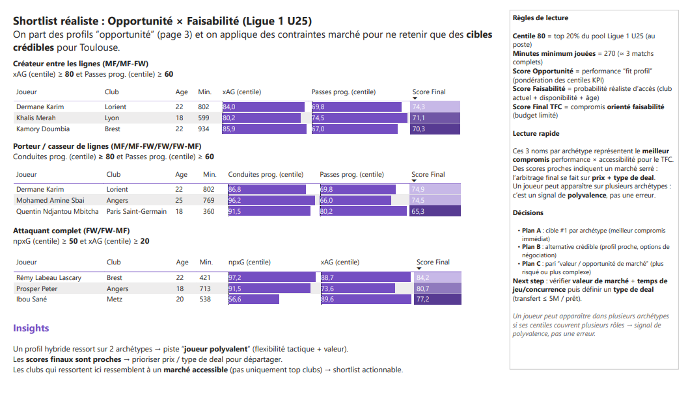
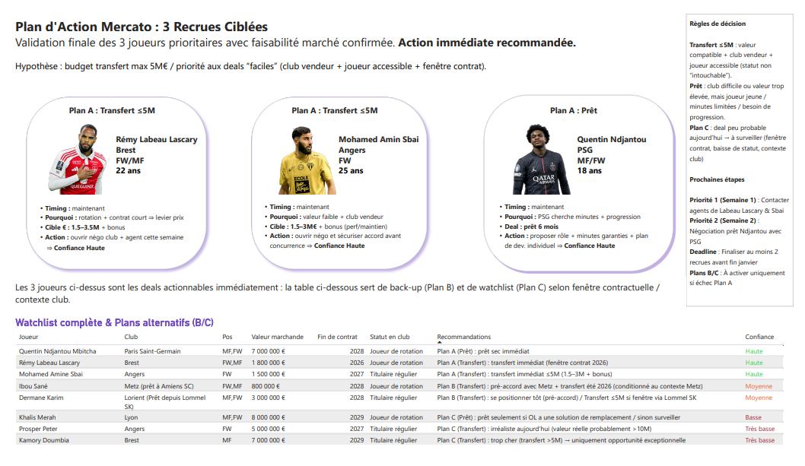
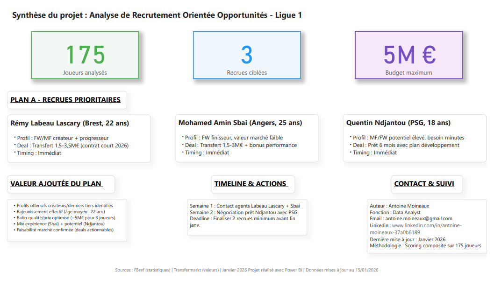

# ⚽ Analyse de Recrutement Data-Driven — Ligue 1 U25 (Cas TFC)

> Comment recruter intelligemment avec 5M€ ? En laissant la data faire le premier tri — et le marché trancher.


---

## 👤 À propos de ce projet

Je suis **Antoine Moineaux**, Data Analyst. Ce projet est le **3e de mon portfolio**, et le premier construit autour d'un sujet qui me passionne : le football.

Chacun de mes projets démontre une facette différente du métier de data analyst :

| # | Projet | Compétences démontrées |
|---|--------|----------------------|
| 1 | [Mobility Operations Performance](https://github.com/AntoineMoineaux/mobility-operations-performance) | SQL, Power BI, analyse opérationnelle, KPIs métier |
| 2 | [Fitness Retention Analysis](https://github.com/AntoineMoineaux/fitness-retention-analysis) | Product analytics, rétention utilisateur, analyse comportementale |
| **3** | **Ce projet — TFC Recruitment Analysis** | **Scoring framework custom, DAX avancé, aide à la décision, domain expertise** |

Ce 3e projet montre ma capacité à **concevoir un framework analytique de bout en bout** : de la définition du problème business jusqu'à des recommandations actionnables, en passant par la construction d'un modèle de scoring multi-couches en DAX. C'est aussi un projet passion qui illustre ce que je peux apporter quand je combine rigueur analytique et connaissance du domaine.

📫 **Me contacter** : [LinkedIn](https://www.linkedin.com/in/antoine-moineaux-37a0b6189) · [Email](mailto:antoine.moineaux@gmail.com)

---

## TL;DR

**175 joueurs U25 de Ligue 1** passés au crible. Un scoring en 3 couches — fit sportif, réalisme marché, score final — pour répondre à une seule question : **qui le TFC peut-il réellement recruter cet hiver, avec 5M€ ?**

Réponse : 3 noms, 3 deals actionnables immédiatement.

| Joueur | Club | Deal | Confiance |
|--------|------|------|-----------|
| Rémy Labeau Lascary | Brest | Transfert ≤ 5M€ | 🟢 Haute |
| Mohamed Amine Sbai | Angers | Transfert ≤ 5M€ | 🟢 Haute |
| Quentin Ndjantou Mbitcha | PSG | Prêt sec | 🟢 Haute |

---

## 📋 Sommaire

- [Contexte & problème](#contexte--problème)
- [L'insight clé](#linsight-clé)
- [La méthode : 3 couches de scoring](#la-méthode--3-couches-de-scoring)
- [Les 6 pages du dashboard](#les-6-pages-du-dashboard)
- [Les résultats : 8 joueurs, 3 plans](#les-résultats--8-joueurs-3-plans)
- [Dataset & périmètre](#dataset--périmètre)
- [Limites & data quality](#limites--data-quality)
- [Et après ?](#et-après-)
- [Structure du repo](#structure-du-repo)
- [How to run](#how-to-run)
- [Compétences démontrées](#compétences-démontrées)

---

## Contexte & problème

**Situation** : Mercato hivernal, janvier 2026. Le Toulouse FC cherche à renforcer son effectif avec des profils offensifs U25 issus de Ligue 1. Contrainte : le budget transfert ne dépasse pas **5M€**.

**Le problème classique du scouting** : il y a beaucoup de bons joueurs en Ligue 1. Mais "bon joueur" ne veut pas dire "joueur accessible". Un attaquant exceptionnel verrouillé au PSG ne vaut rien pour le TFC. Un créateur talentueux dont le contrat expire dans 6 mois vaut de l'or.

**La question** : Comment construire une méthode qui identifie d'abord le talent (fit sportif), puis filtre par la réalité du marché (faisabilité), pour sortir une shortlist **réellement actionnable** ?

---

## L'insight clé

> Le meilleur recrutement n'est pas le meilleur joueur. C'est le meilleur joueur **que tu peux réellement avoir**.

Après analyse de 175 joueurs U25, le constat est clair :

- **Les meilleurs profils sportifs sont souvent les moins accessibles** — contrats longs, clubs vendeurs en position de force, valeurs marché hors budget
- **Les vraies opportunités sont à l'intersection** entre performance solide ET contexte favorable (contrat expirant, club vendeur, besoin de temps de jeu)
- **Un scoring orienté 70% faisabilité / 30% talent** donne de bien meilleurs résultats qu'un classement purement sportif

→ Le framework ne cherche pas "le meilleur joueur". Il cherche **le meilleur deal**.

---

## La méthode : 3 couches de scoring

Le modèle fonctionne comme un entonnoir en 3 étapes. Chaque couche élimine du bruit pour converger vers des recommandations actionnables.

### Couche 1 — Opportunité sportive : "Est-ce qu'il correspond au profil ?"

Trois archétypes de joueurs recherchés, chacun avec des seuils de centiles spécifiques (calculés au sein du pool Ligue 1 U25, par poste) :

| Archétype | Ce qu'on cherche | Filtres |
|-----------|-----------------|---------|
| **Créateur entre les lignes** | Un joueur qui génère des occasions de qualité et fait avancer le jeu par la passe | xAG_Pctl ≥ 80 ET PrgP_Pctl ≥ 60 |
| **Porteur / Casseur de lignes** | Un joueur qui casse les lignes adverses par la conduite et combine avec des passes progressives | PrgC_Pctl ≥ 80 ET PrgP_Pctl ≥ 60 |
| **Attaquant complet** | Un attaquant qui marque (npxG élevé) mais contribue aussi à la création | npxG_Pctl ≥ 50 ET xAG_Pctl ≥ 20 |

Chaque archétype a sa formule de scoring. Exemple pour l'attaquant complet :
```
Opportunité = 0.75 × npxG_Pctl + 0.25 × xAG_Pctl
```

### Couche 2 — Faisabilité : "Est-ce qu'on peut réellement l'avoir ?"

```
Faisabilité = ~1/3 Club Tier + ~1/3 Disponibilité + ~1/3 Score Âge
```

C'est la couche qui distingue ce projet d'un simple classement de joueurs. Un joueur du PSG titulaire avec 4 ans de contrat ? Faisabilité basse. Un joueur d'Angers en rotation avec un contrat qui expire ? Faisabilité haute.

### Couche 3 — Score Final TFC : "Quel est le meilleur compromis ?"

```
Score Final = 0.70 × Faisabilité + 0.30 × Opportunité
```

**Pourquoi 70/30 en faveur de la faisabilité ?** Parce qu'avec un budget de 5M€, un joueur à 95% de fit sportif mais 10% de faisabilité est un fantasme. Un joueur à 75% de fit et 85% de faisabilité est un recrutement.

---

## Les 6 pages du dashboard

Le dashboard raconte une histoire en 6 actes. Chaque page répond à une question et prépare la suivante.

### Page 1 — Synthèse Exécutive
*"Voici ce qu'on cherche, voici ce qu'on a trouvé"*

Vue d'ensemble du projet pour la direction sportive. Le message clé et la recommandation principale en un coup d'œil.


---

### Page 2 — Profils Cibles & Critères
*"Pourquoi ces 3 archétypes, et pas d'autres ?"*

Définition des 3 profils recherchés, des KPI utilisés et des seuils retenus. Cette page justifie les choix méthodologiques — un recruteur ou un directeur sportif doit comprendre la logique avant de voir les noms.



---

### Page 3 — Opportunités Sportives
*"Si l'argent et les contrats n'existaient pas, qui prendrait-on ?"*

Classement purement sportif, avant toute considération de marché. Les centiles par joueur et par archétype montrent qui fit le profil sur le terrain. C'est le classement "rêve" — la réalité vient après.

**L'insight** : Les meilleurs profils sportifs (Doumbia, Peter) sont aussi les plus chers et les moins accessibles. Le talent brut ne suffit pas à construire une shortlist réaliste.



---

### Page 4 — Shortlist Réaliste (Opportunité × Faisabilité)
*"Quand on croise le talent avec la réalité du marché, qui reste ?"*

Le moment de vérité. Le score final TFC (70% faisabilité / 30% opportunité) réorganise complètement le classement. Des joueurs invisibles en page 3 montent. Des stars descendent.

**L'insight** : Le Top 3 par archétype après ce scoring n'est pas le Top 3 sportif. C'est le Top 3 **actionnable** — et c'est exactement ce qu'un club à budget limité a besoin de voir.



---

### Page 5 — Validation Marché & Type de Deal
*"Concrètement, combien ça coûte et comment on fait ?"*

On sort de la data pure pour entrer dans le business. Valeur marchande, statut contractuel, force du club vendeur — le Market Check confronte la shortlist à la réalité du mercato. 3 cartes "héros" pour les Plan A, une table complète avec tooltips pour le reste.

**L'insight** : Labeau Lascary (contrat 2026 = levier de négociation), Sbai (valorisé à 1.5M€ dans un club vendeur), Ndjantou Mbitcha (logique de prêt PSG) — trois mécanismes de deal complètement différents, trois niveaux de confiance haute.



---

### Page 6 — Shortlist Finale & Recommandations
*"Qui prendre, comment, et pourquoi"*

La synthèse de tout le travail. Plan d'action priorisé avec les 3 recommandations Plan A actionnables immédiatement, les Plan B à surveiller, et les Plan C en benchmark.



---

## Les résultats : 8 joueurs, 3 plans

### 🏆 Plan A — Actionnables immédiatement

**Rémy Labeau Lascary** (Brest) — Transfert ≤ 5M€
Contrat expirant en 2026 = le club vendeur a intérêt à négocier maintenant plutôt que perdre le joueur libre. Fenêtre d'opportunité claire. Confiance 🟢 haute.

**Mohamed Amine Sbai** (Angers) — Transfert ≤ 5M€
Valeur estimée ~1.5M€. Angers en position de vendeur. Rapport qualité/prix excellent. Confiance 🟢 haute.

**Quentin Ndjantou Mbitcha** (PSG) — Prêt sec
Logique de développement côté PSG : le joueur a besoin de minutes dans un contexte compétitif. Pas d'indemnité de transfert. Confiance 🟢 haute.

### 📋 Plan B — Bon fit, fenêtre à surveiller

| Joueur | Situation | Confiance |
|--------|----------|-----------|
| Dermane Karim | Lorient (prêt Lommel) — pré-accord possible via Lommel | 🟡 Moyenne |
| Ibou Sané | Metz (prêt Amiens) — dépend du maintien/descente de Metz cet été | 🟡 Moyenne |

### 📋 Plan C — Watchlist / Benchmark

| Joueur | Pourquoi c'est bloqué | Confiance |
|--------|----------------------|-----------|
| Khalis Merah | OL, effectif restreint, prêt peu probable | 🔴 Basse |
| Prosper Peter | Valeur réelle prob. > 10M€, hors budget | ⚫ Très basse |
| Kamory Doumbia | Valorisation > 5M€, sert de benchmark | ⚫ Très basse |

**Grille de lecture** :
- **Plan A** = Deal actionnable maintenant (transfert ≤ 5M€ ou prêt logique)
- **Plan B** = Bon fit mais dépend d'une fenêtre future (pré-accord, été 2026, club tiers)
- **Plan C** = Trop cher ou peu probable — surveiller si le contexte évolue

---

## Dataset & périmètre

| Paramètre | Valeur |
|-----------|--------|
| **Population** | Joueurs de Ligue 1, focus U25 |
| **Saison** | 2025–2026 (données au mercato hivernal, janvier 2026) |
| **Taille** | ~175 joueurs analysés |
| **Unité d'analyse** | Joueur (âge, minutes, poste, club, centiles de performance) |
| **Filtre de fiabilité** | Minimum 270 minutes jouées (≈ 3 matchs complets) |
| **Segmentation** | Par poste (MF, MF-FW, FW, FW-MF) |
| **Centiles** | Calculés au sein du pool L1 U25 par poste |

---

## Limites & data quality

- **Erreurs de position** : certaines données de poste comportent des inexactitudes (ex : Fodé Doucouré classé MF alors qu'il joue DD). Des filtres visuels et de la prudence sur la variable "Pos" ont été maintenus
- **Seuil de 270 minutes** : réduit le bruit statistique mais n'élimine pas tous les biais liés aux petits échantillons
- **Market Check = données manuelles** : valeurs marché et contrats issus de sources publiques, dépendants du timing de collecte (janvier 2026)
- **Modèle ≠ vérité** : ce framework est un outil d'aide au scouting. Il doit être complété par du visionnage vidéo, des contacts agents, et de l'expertise terrain

---

## Et après ?

Si ce projet était réel, les prochaines étapes seraient :

- Élargir le pool à d'autres ligues (Ligue 2, Eredivisie, Liga Portugal) pour augmenter les comparaisons
- Intégrer des données défensives (pressings, duels, récupérations) pour couvrir d'autres postes
- Automatiser la collecte Market Check via API (Transfermarkt, FBref)
- Ajouter un axe "progression sur N saisons" pour évaluer les trajectoires de développement
- Inclure des radar charts joueur vs archétype idéal pour la comparaison directe

Ce projet se concentre sur le diagnostic et la recommandation, pas sur l'automatisation.

---

## Structure du repo

```
📂 tfc-recruitment-analysis/
├── 📄 README.md                  ← Ce fichier
├── 📂 dashboard/                 ← Screenshots des 6 pages
├── 📂 data/                      ← Dictionnaire de données
├── 📂 docs/                      ← Méthodologie, définitions KPI, market check
├── 📂 powerbi/                   ← Infos sur le fichier Power BI
└── 📂 assets/                    ← Visuels
```

Documentation détaillée :
- Méthodologie complète → [`docs/methodology.md`](docs/methodology.md)
- Définitions des KPI → [`docs/kpi_definitions.md`](docs/kpi_definitions.md)
- Table Market Check détaillée → [`docs/market_check.md`](docs/market_check.md)

---

## How to run

1. **Cloner le repo** : `git clone https://github.com/AntoineMoineaux/tfc-recruitment-analysis.git`
2. **Dashboard** : screenshots dans `/dashboard/` (le fichier `.pbix` est disponible en local uniquement)
3. **Documentation** : explorer `/docs/` pour la méthodologie, les KPI et le market check détaillé

---

## Compétences démontrées

| Compétence | Application dans ce projet |
|-----------|---------------------------|
| **Power BI & DAX avancé** | Dashboard 6 pages, mesures DAX custom, scoring multi-couches en DAX |
| **Conception de framework analytique** | Modèle Opportunité × Faisabilité en 3 couches, pondérations argumentées |
| **Storytelling data** | Narration en 6 actes : contexte → critères → talent brut → réalité marché → deal → recommandation |
| **Aide à la décision** | Recommandations Plan A/B/C avec niveaux de confiance et justifications business |
| **Domain expertise** | Métriques football (xAG, npxG, PrgC), contexte transferts/prêts/contrats, réalisme marché |
| **Rigueur méthodologique** | Limites documentées, seuils de fiabilité, transparence sur la qualité des données |

---

> *Ce projet est un cas d'école en scouting data. Les recommandations sont basées sur un modèle analytique et ne constituent pas des vérités club. Les valeurs marché et données contractuelles sont des estimations issues de sources publiques.*
